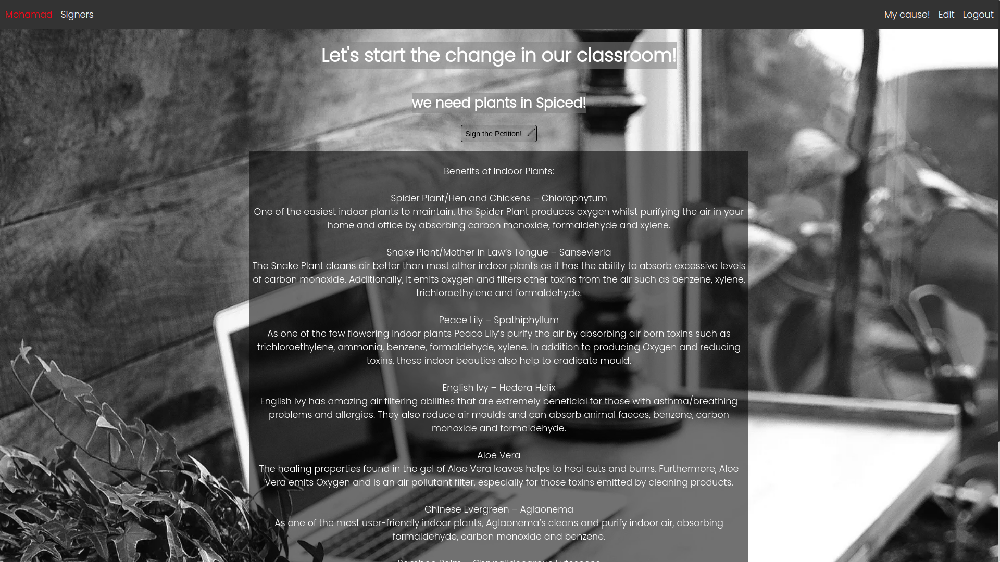
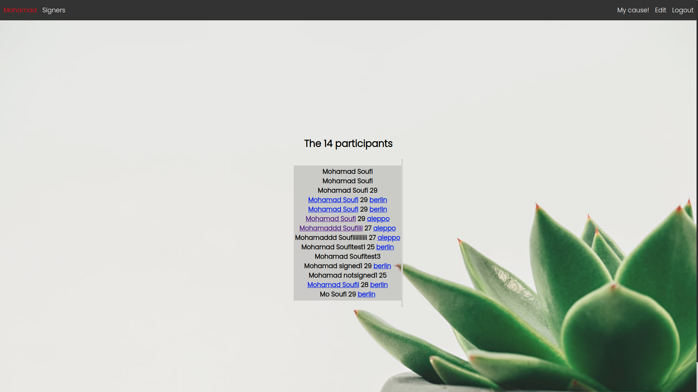

# Petition

#### npm start

Runs the app in the development mode.
Open http://localhost:8080 to view it in the browser.

The page will reload if you make edits.

## Technologies:

-   Handlebars
-   jQuery
-   canvas2D
-   Node.js
-   Express
-   Jest

## Features:

-   login and register
-   sign the petition and update the signature
-   update profile and password

This is the home page where the user is able to read about the Petition topic then click on the sign button to sign.

This is how to sign the Petition.

It's also possible to resign / unsign the Petition.

On the edit page, the user is able to edit all of his / her data.

All the signers' info are accessible for who signed the petition.
Also by clicking on the city filters the signers by the city.

